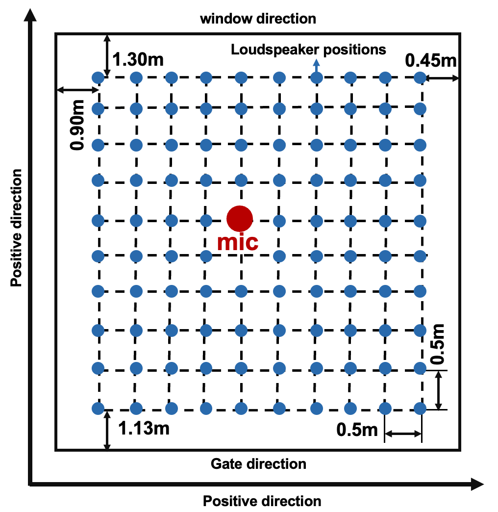

# Real Grid RIR Dataset 
This dataset contains real collected room impluse response (RIR) from a meeting room. 
The dataset is a location-specific RIR dataset where microphones are static and sound sources are distributed on a grid on the room floor. The RIR is collected using sine sweep method and is collected using an eight-channel microphone.

This dataset has three subdatasets:
1. The first dataset was measured in all four directions at each of the 98 source locations (up, down, left, right). The microphone is placed on the center of the room.
2. The second dataset was measured only once at all 98 locations, with the microphone located in the center of the room.
3. The third dataset placed the microphone in the upper right corner of the room and measured the RIR once at each of the 98 locations.

This dataset is suitable for the spatial-based research, especially the distance related, such as sound source distance estimation, distance based sound separation and extraction tasks. The measurement environment and the room configuration are shown in the figure. The room size is about 5.9×6.9×2.9 meters with an RT60 of 0.60s.

  
  

# Infos and preprocessing
- The dataset is collected using a eight-channel microphone, the channel 1 (RIR1.wav) is the negative direction along the y axis as shown in figure. Channel1 to channel8 (RIR1.wav to RIR8.wav) are arranged counterclockwise from the top-down view.
- Put the 'grid01', 'grid02', and 'grid03' folders at the same level as process.ipynb.
- Change the root path and target path in process.ipynb and run.
- The provided preprocessing file is used for distance usage, the direction of arrival is not included.

# References
The measurement method is adopted from:
https://github.com/maj4e/pyrirtool
>>>>>>> 6b91c32 (Initial commit)
